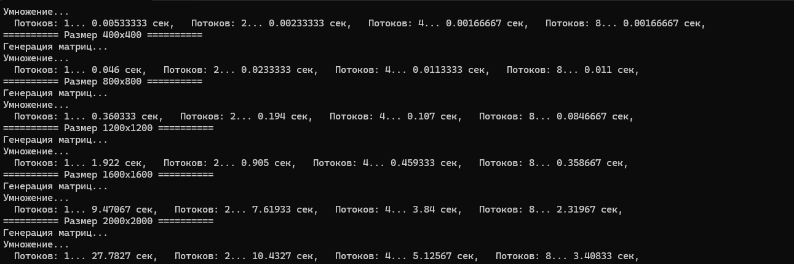
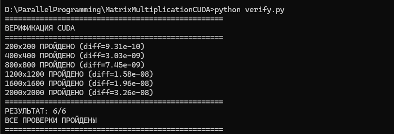
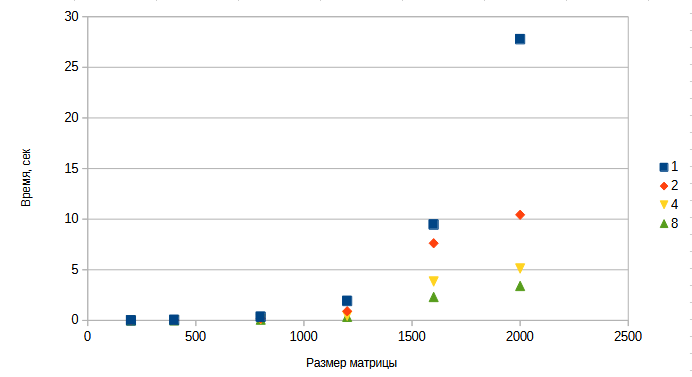

# Лабораторная работа №2: Параллельное умножение матриц с использованием OpenMP

## Автор
- **Студент:** Рыжков М.А.
- **Группа:** 6311
- **Курс:** Параллельное программирование

---

## Цель работы
Модифицировать программу из лабораторной работы №1 для параллельного умножения матриц с использованием технологии OpenMP, провести эксперименты с разным количеством потоков (1, 2, 4, 8) и разными размерами матриц (200, 400, 800, 1200, 1600, 2000).

---
### Используемые директивы

#### Директива `parallel for`
Объединяет создание параллельной области и распределение итераций цикла между потоками.

#### Предложение `collapse(n)`
Объединяет n вложенных циклов в один параллельный цикл.

#### Функция `omp_set_num_threads()`
Устанавливает количество потоков для параллельных областей.

#### Функция `omp_get_max_threads()`
Возвращает максимальное количество потоков, доступных в системе.
## Реализация

### Алгоритм умножения
Используется оптимизированный порядок циклов **i-k-j**, который обеспечивает эффективное использование кэш-памяти процессора:

```cpp
vector<vector<double>> multiplyParallel(const vector<vector<double>>& A,
    const vector<vector<double>>& B,
    int numThreads) {
    int n = A.size();
    vector<vector<double>> C(n, vector<double>(n, 0.0));

    omp_set_num_threads(numThreads);

#pragma omp parallel for collapse(2)
    for (int i = 0; i < n; ++i) {
        for (int j = 0; j < n; ++j) {
            double sum = 0.0;
            for (int k = 0; k < n; ++k) {
                sum += A[i][k] * B[k][j];
            }
            C[i][j] = sum;
        }
    }

    return C;
}
```


### Генерация матриц
Матрицы генерируются случайным образом с использованием генератора mt19937:

```cpp
vector<vector<double>> generateMatrix(int n) {
    vector<vector<double>> matrix(n, vector<double>(n));
    random_device rd;
    mt19937 gen(rd());
    uniform_real_distribution<double> dist(0.0, 100.0);

#pragma omp parallel for collapse(2)
    for (int i = 0; i < n; ++i)
        for (int j = 0; j < n; ++j)
            matrix[i][j] = dist(gen);

    return matrix;
}
```

### Сохранение матриц
Результаты сохраняются в файлы с высокой точностью (15 знаков после запятой) для корректной верификации:

```cpp
void saveMatrix(const string& filename, const vector<vector<double>>& matrix) {
    ofstream file(filename);
    int n = matrix.size();
    file << n << endl;
    file << fixed << setprecision(15);
    for (int i = 0; i < n; ++i) {
        for (int j = 0; j < n; ++j) {
            file << matrix[i][j];
            if (j < n - 1) file << " ";
        }
        file << endl;
    }
    file.close();
}

```
## Описание экспериментов

### Цель экспериментов
Определить зависимость времени выполнения параллельного умножения матриц от их размера и количества потоков.

### Параметры экспериментов
- **Размеры матриц:** 200, 400, 800, 1200, 1600, 2000
- **Тип данных:** double (64-битные числа с плавающей точкой)
- **Количество потоков:** 1, 2, 4, 8
- **Количество запусков:** 3 для каждого размера и количества потоков (берётся среднее)
- **Измеряемые параметры:**
  - Время выполнения (секунды)

### Методика проведения
1. Для каждого размера n генерируются две случайные матрицы A и B размером n×n
2. Матрицы сохраняются в файлы для последующей верификации
3. Выполняется параллельное умножение матриц C = A × B с использованием OpenMP
4. Эксперимент повторяется для каждого количества потоков (1, 2, 4, 8)
5. Для точности измерений каждый эксперимент выполняется 3 раза, вычисляется среднее время
6. Результаты сохраняются в CSV файл для анализа
7. Выполняется верификация путём сравнения с эталонным умножением в NumPy

## Результат выполнения программы



## Результат верификации

```
## Результаты экспериментов
### Время выполнения

| Размер | 1 поток | 2 потока | 4 потока | 8 потоков |
|--------|---------|----------|----------|-----------|
| 200 | 0.0053 | 0.0023 | 0.0017 | 0.0017 |
| 400 | 0.0460 | 0.0233 | 0.0113 | 0.0110 |
| 800 | 0.3603 | 0.1940 | 0.1070 | 0.0847 |
| 1200 | 1.9220 | 0.9050 | 0.4593 | 0.3587 |
| 1600 | 9.4707 | 7.6193 | 3.8400 | 2.3197 |
| 2000 | 27.7827 | 10.4327 | 5.1257 | 3.4083 |

### График зависимости времени от размера матрицы и числа потоков


### Анализ
1. **Временная сложность:** Время выполнения растет пропорционально **O(n³)** для любого количества потоков, что соответствует теоретической сложности алгоритма умножения матриц.

2. **Эффективность параллелизации:** 
   - Для маленьких матриц (200×200) разница между 2, 4 и 8 потоками незначительна
   - Для больших матриц (≥800×800) наблюдается ускорение при увеличении количества потоков

3. **Масштабируемость:** Наилучшее ускорение достигнуто для матрицы 2000×2000 — **8.15x** на 8 потоках

## Запуск

### Настройка OpenMP в Visual Studio
1. Откройте свойства проекта (правый клик → Properties)
2. **C/C++ → Language → OpenMP Support → Yes (/openmp)**
3. Выберите конфигурацию **Release** и платформу **x64**

### Запуск программы
1. Откройте проект в Visual Studio
2. Нажмите **Ctrl+F5**
3. Программа выполнит эксперименты для всех размеров и количества потоков

### Результаты
- Папка `results_openmp/` с результатами экспериментов
- Файл `results_openmp/results.csv` с таблицей времени выполнения

---

## Запуск верификации

### Windows (командная строка)
```bash
pip install numpy
python verify.py
```

## Выводы

1. Программа успешно модифицирована для параллельного умножения матриц с использованием OpenMP. Для матрицы 2000×2000 достигнуто ускорение **8.15x** на 8 потоках. Общее ускорение относительно последовательной версии (Lab1) составляет **~55 раз** (189 сек → 3.4 сек). Ускорение растёт с увеличением размера матрицы. Для маленьких матриц (200×200) накладные расходы ограничивают эффективность, для больших (≥800×800) ускорение близко к количеству потоков. Цель работы достигнута — OpenMP-версия демонстрирует значительное ускорение по сравнению с последовательной.