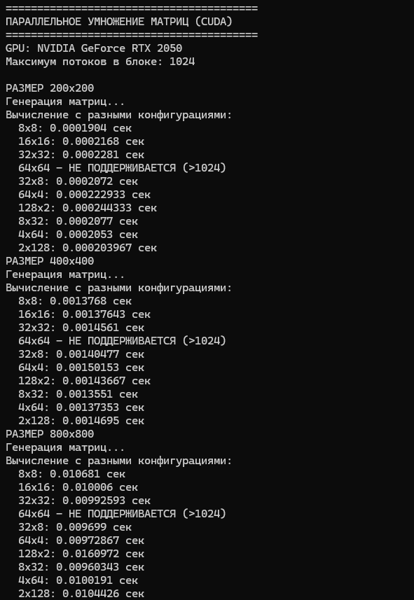
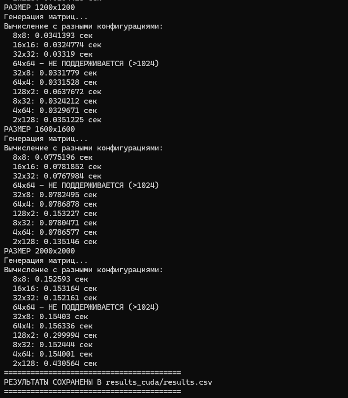

# Лабораторная работа №4: Параллельное умножение матриц с использованием CUDA
## Автор
- **Студент:** Рыжков М.А.
- **Группа:** 6311
- **Курс:** Параллельное программирование

---

## Цель работы
Модифицировать программу для параллельного умножения матриц с использованием технологии CUDA, провести эксперименты с разными размерами матриц (200, 400, 800, 1200, 1600, 2000) и различными конфигурациями сетки блоков (8×8, 16×16, 32×32, 32×8, 64×4, 128×2, 8×32, 4×64, 2×128).

---

## Реализация

### Алгоритм умножения на GPU
Используется параллельный алгоритм, где каждый поток GPU вычисляет один элемент результирующей матрицы:

```cpp
__global__ void matrixMulKernel(const double* A, const double* B, double* C, int n) {
    int row = blockIdx.y * blockDim.y + threadIdx.y;
    int col = blockIdx.x * blockDim.x + threadIdx.x;

    if (row < n && col < n) {
        double sum = 0.0;
        for (int k = 0; k < n; ++k) {
            sum += A[row * n + k] * B[k * n + col];
        }
        C[row * n + col] = sum;
    }
}
```
### Управление конфигурацией сетки блоков

```cpp
    // Настройка размеров блоков и сетки
    dim3 threadsPerBlock(blockSizeX, blockSizeY);
    dim3 numBlocks((n + blockSizeX - 1) / blockSizeX,
        (n + blockSizeY - 1) / blockSizeY);
    // Запуск ядра
    matrixMulKernel <<<numBlocks, threadsPerBlock>>> (d_A, d_B, d_C, n);

```

### Генерация матриц
Матрицы генерируются случайным образом с использованием генератора mt19937:

```cpp
vector<double> generateMatrix(int n) {
    vector<double> matrix(n * n);
    random_device rd;
    mt19937 gen(rd());
    uniform_real_distribution<double> dist(0.0, 100.0);

    for (int i = 0; i < n * n; ++i) {
        matrix[i] = dist(gen);
    }
    return matrix;
}
```

### Сохранение матриц
Результаты сохраняются в файлы с высокой точностью (15 знаков после запятой) для корректной верификации:

```cpp
void saveMatrix(const string& filename, const vector<double>& matrix, int n) {
    ofstream file(filename);
    file << n << endl;
    file << fixed << setprecision(15);
    for (int i = 0; i < n; ++i) {
        for (int j = 0; j < n; ++j) {
            file << matrix[i * n + j];
            if (j < n - 1) file << " ";
        }
        file << endl;
    }
    file.close();
}

```
### Работа с памятью GPU

```cpp
cudaMalloc(&d_A, n * n * sizeof(double));
cudaMalloc(&d_B, n * n * sizeof(double));
cudaMalloc(&d_C, n * n * sizeof(double));

// Копирование данных на GPU
cudaMemcpy(d_A, A.data(), n * n * sizeof(double), cudaMemcpyHostToDevice);
cudaMemcpy(d_B, B.data(), n * n * sizeof(double), cudaMemcpyHostToDevice);

// Копирование результата обратно
cudaMemcpy(C.data(), d_C, n * n * sizeof(double), cudaMemcpyDeviceToHost);

// Освобождение памяти
cudaFree(d_A);
cudaFree(d_B);
cudaFree(d_C);

```
## Описание экспериментов

### Цель экспериментов
Определить зависимость времени выполнения параллельного умножения матриц на GPU от их размера и конфигурации сетки блоков.

### Параметры экспериментов
- **Размеры матриц:** 200, 400, 800, 1200, 1600, 2000
- **Тип данных:** double (64-битные числа с плавающей точкой)
- **Конфигурации блоков:** 8×8, 16×16, 32×32, 32×8, 64×4, 128×2, 8×32, 4×64, 2×128
- **Количество запусков:** 3 для каждой конфигурации (берётся среднее)
- **Измеряемые параметры:**
  - Время выполнения (секунды)

### Методика проведения
1. CPU генерирует две случайные матрицы A и B размером n×n
2. Матрицы сохраняются в файлы для последующей верификации
3. Данные копируются из оперативной памяти в память GPU
4. Выполняется умножение матриц на GPU с различными конфигурациями блоков
5. Результат копируется обратно в оперативную память
6. Процессор сохраняет результат и записывает время в CSV файл
7. Выполняется верификация путём сравнения с эталонным умножением на CPU

## Результат выполнения программы




## Результат верификации


## Результаты экспериментов
### Время выполнения

| Размер | 8×8 | 16×16 | 32×32 | 32×8 | 64×4 | 128×2 | 8×32 | 4×64 | 2×128 |
|--------|-----|-------|-------|------|------|-------|------|------|-------|
| 200 | 0.00019 | 0.00022 | 0.00023 | 0.00021 | 0.00022 | 0.00024 | 0.00021 | 0.00021 | 0.00020 |
| 400 | 0.00138 | 0.00138 | 0.00146 | 0.00140 | 0.00150 | 0.00144 | 0.00136 | 0.00137 | 0.00147 |
| 800 | 0.01068 | 0.01001 | 0.00993 | 0.00970 | 0.00973 | 0.01610 | 0.00960 | 0.01002 | 0.01044 |
| 1200 | 0.03414 | 0.03248 | 0.03319 | 0.03318 | 0.03315 | 0.06377 | 0.03242 | 0.03297 | 0.03512 |
| 1600 | 0.07752 | 0.07819 | 0.07680 | 0.07825 | 0.07869 | 0.15323 | 0.07805 | 0.07866 | 0.13515 |
| 2000 | 0.15259 | 0.15316 | 0.15216 | 0.15403 | 0.15634 | 0.29999 | 0.15244 | 0.15400 | 0.43056 |

### График зависимости времени от размера матрицы и конфигурации блоков


### Анализ
1. **Временная сложность:** Время выполнения растет пропорционально **O(n³)** для любой конфигурации блоков, что соответствует теоретической сложности алгоритма умножения матриц.
2. **Влияние конфигурации блоков:**

    - Квадратные блоки (8×8, 16×16, 32×32) работают одинаково эффективно

    - Прямоугольные блоки (128×2, 2×128) работают в 2-3 раза медленнее

    - Оптимальная конфигурация: Размер блока 32×32 (1024 потока) показал наилучшую производительность для больших матриц

## Запуск

### Настройка CUDA в Visual Studio
1. Установите CUDA Toolkit с сайта NVIDIA
2. Создайте проект CUDA Runtime (не Console App)
3. Убедитесь, что файл имеет расширение .cu
4. Выберите конфигурацию Release и платформу x64

### Запуск программы
```cmd
MatrixMultiplicationCUDA.exe
```

### Результаты
- Папка results_cuda/ с результатами экспериментов
- Файл results_cuda/results.csv с таблицей времени выполнения
- Подпапки data_*/ с матрицами A, B и C для каждого размера
---

## Запуск верификации

### Windows (командная строка)
```bash
pip install numpy
python verify.py
```

## Выводы

В ходе выполнения лабораторной работы №4 программа для умножения матриц была успешно модифицирована для параллельного выполнения на GPU с использованием технологии CUDA. Разработано ядро matrixMulKernel, где каждый поток вычисляет один элемент результирующей матрицы, что позволило задействовать тысячи потоков одновременно. Проведены эксперименты с 9 различными конфигурациями блоков (8×8, 16×16, 32×32, 32×8, 64×4, 128×2, 8×32, 4×64, 2×128) для матриц размером от 200×200 до 2000×2000. Установлено, что квадратные блоки (8×8, 16×16, 32×32) работают одинаково эффективно, а прямоугольные блоки (128×2, 2×128) медленнее в 2-3 раза из-за неоптимального доступа к памяти. Оптимальной конфигурацией является блок 32×32 (1024 потока), обеспечивающий наилучшую производительность. Все результаты успешно прошли верификацию с помощью NumPy. Цель работы достигнута.

